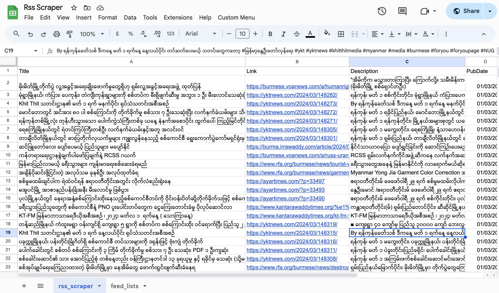

## Version 1.1
- added monthly trigger
- data will be back up with separate month sheets.

# RSS Feed Scraper for Google Sheets

This script is designed to scrape RSS feeds and save the scraped data into a Google Sheet. It automates the process of reading RSS feed URLs and their corresponding names from a specific sheet, fetching and parsing these feeds, and then saving the extracted data (article titles, links, descriptions, publication dates, and feed names) into a target sheet within the same Google Spreadsheet.

## Preconditions

- Open [Google Apps Script](https://script.google.com) and copy the contents of the provided `.gs` script, naming it accordingly.
- The Google Spreadsheet must contain a sheet named `feed_lists` with:
  - RSS feed URLs in column B.
  - Feed names in column A.
  - Sample sheet layout: 

- Set the `SPREADSHEET_ID` and `SHEET_NAME` variables to your Google Spreadsheet ID and the target sheet name, respectively, as shown in this example: 

- Ensure the Google Apps Script project has the necessary permissions to access the Google Spreadsheet and to fetch external data from the RSS feed URLs.
- Identify the correct RSS feed URLs of the news sources you wish to monitor.

## Postconditions

After execution, the target sheet in the specified Google Spreadsheet will be populated with the latest articles from the RSS feeds, avoiding duplication of existing articles.

## Usage

1. Prepare the Google Spreadsheet with a `feed_lists` sheet containing RSS feed URLs and names.
2. Replace `SPREADSHEET_ID` in the script with the actual ID of your Google Spreadsheet.
3. Replace `SHEET_NAME` with the name of the target sheet for saving RSS feed data.
4. Manually run the `scrapeRSS()` function or trigger it programmatically to begin scraping data.

## Function Details

- `scrapeRSS()`: Initiates the RSS feed scraping process.
- `parseDescription(description)`: Parses and extracts text content from the RSS feed's description.
- `formatDate(dateString)`: Formats publication dates into `dd/MM/yyyy`.
- `onOpen()`: Creates a custom menu in the Google Sheets UI for easy access to the `scrapeRSS` function.
- `archiveDataByMonth()`: Archives data to a new Google Sheets file.
- `createMonthlyTrigger()`: Sets up a monthly trigger to automatically archive old data. This one is already included.
- `createTwoHourlyTrigger()`: Sets up a trigger to run scrapeRSS every 2 hours.(Need to setup in Google Appscript trigger setting)

## Notes

- Modifications may be required for RSS feeds with structures significantly different from standard formats.
- Error handling logs issues encountered during the RSS feed fetching process.
- This script is tested with Google Apps Script and Google Sheets and may not work with standard JavaScript.

## For ref
- For full reference, check out this [Gsheet Url](https://docs.google.com/spreadsheets/d/1xQY6fUu-lN9MNr2pfk3dMYt6G_QNXbT5U7BNocRmWDE/edit#gid=1365274149)

---

**Author**: Nyein Chan Ko Ko  
**Version**: 1.1  
**Since**: December 2023
